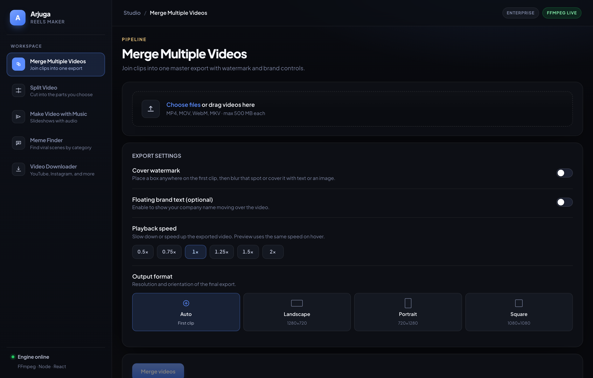
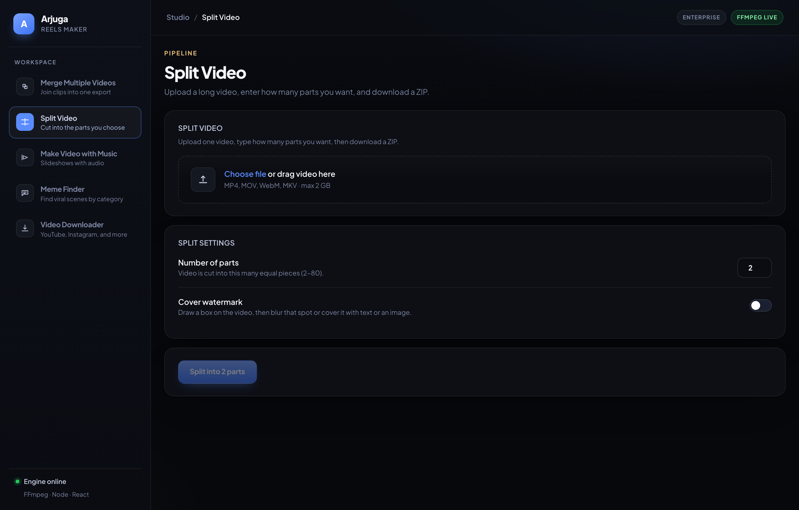
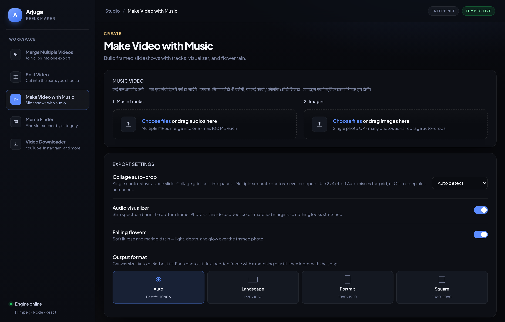
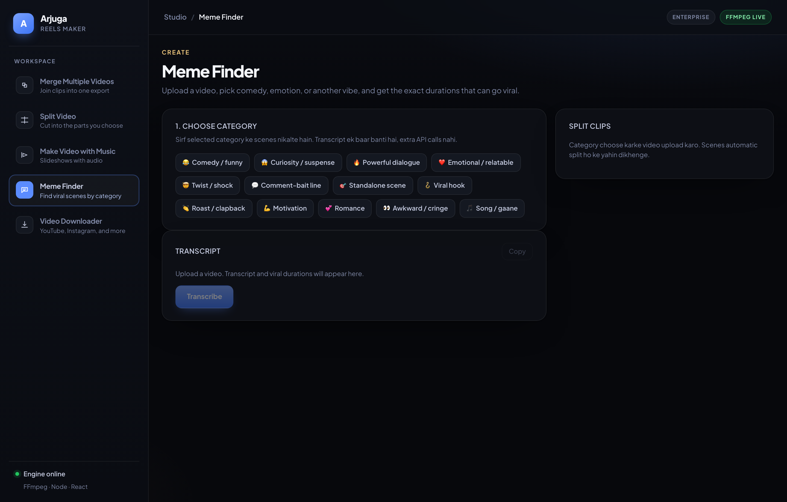
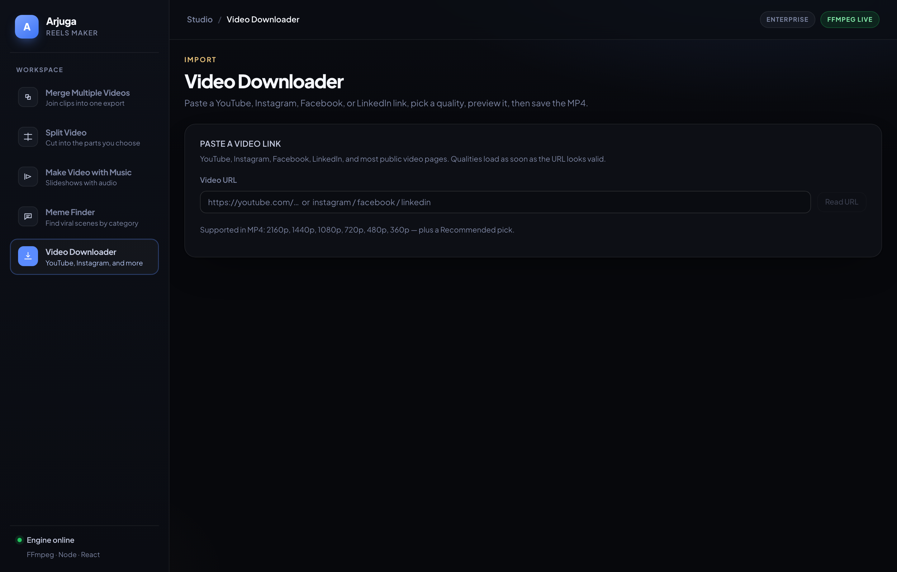

# Arjuga Reels Maker

Local video studio for Reels, Shorts, and YouTube clips. Merge, split, make
music videos, find viral scenes, and download from a URL — all from one dark UI.

- **Frontend:** React + Vite · `http://localhost:5173`
- **Node backend:** Express + FFmpeg · `http://localhost:5050`
- **Python backend:** FastAPI + yt-dlp · `http://127.0.0.1:5051`

The browser talks only to Node (`/api`). Node proxies URL import and
transcription to Python.



## Tools

| Tool | What it does |
| --- | --- |
| **Merge Multiple Videos** | Join clips into one MP4. Optional cover box (blur / text / image) over a watermark. |
| **Split Video** | Cut one video into N equal parts and download a ZIP. Same cover option. |
| **Make Video with Music** | Photos + MP3 → slideshow with visualizer and flower rain. |
| **Meme Finder** | Pick a category (comedy, song, roast…), upload a movie/clip, get transcript + split scenes. |
| **Video Downloader** | Paste YouTube / Instagram / Facebook / LinkedIn URL, pick quality, save MP4. |

## Screenshots

### Merge Multiple Videos

Drop clips, cover a watermark if needed, export one file.


### Split Video

Set how many parts you want. Output is a ZIP.



### Make Video with Music

Queue images and tracks, then export a music video.



### Meme Finder

Choose a category first (comedy, song, romance…). Transcript is generated
once. Scenes are cut for **that category only**, across the full video.
Movie intro / logos are skipped. Language is always auto-detect.



### Video Downloader

Paste a public link, choose quality, preview, download.



## Project structure

```
.
├── backend/                 Node API (5050) — merge, split, music, meme split
│   ├── server.js
│   ├── .env                 OPENAI_API_KEY (not committed)
│   └── .gitignore
├── backend-python/          FastAPI (5051) — URL import + transcribe
│   ├── app.py
│   ├── start.sh
│   └── .gitignore
├── frontend/                React + Vite (5173)
├── scripts/                 README screenshot helpers
└── docs/screenshots/
```

Generated files stay in `backend/uploads`, `backend/output`,
`backend-python/uploads`, and `backend-python/output`. They use fixed
`*-latest` names and are gitignored so the repo does not fill up.

## Requirements

- Node.js 18+
- npm 9+
- Python 3.10+ (3.12 / 3.13 recommended). macOS system Python 3.9 is not enough for yt-dlp.

FFmpeg comes from `ffmpeg-static`. A separate FFmpeg install is optional.

## Setup

```bash
cd backend && npm install
cd ../frontend && npm install
```

Python (first time):

```bash
cd backend-python
chmod +x start.sh
./start.sh
```

Add your key in `backend/.env` (never commit this file):

```bash
OPENAI_API_KEY=sk-...
```

The key is used only for:

1. **Meme Finder — Find moments** (`gpt-4o-mini`) after a transcript exists
2. **Transcribe fallback** (`gpt-4o-transcribe`) when YouTube captions are missing

Upload, URL download, YouTube captions, FFmpeg split/ZIP, and category
re-select from cache do **not** call OpenAI.

## Run (development)

Three terminals.

**1 — Node** (`5050`):

```bash
cd backend
npm start
```

`npm start` does not auto-reload. Restart after `server.js` changes.

**2 — Python** (`5051`):

```bash
cd backend-python
./start.sh
```

Full Python notes: [backend-python/README.md](backend-python/README.md)

**3 — Frontend** (`5173`):

```bash
cd frontend
npm run dev
```

Open [http://localhost:5173](http://localhost:5173).

```bash
curl http://localhost:5050/api/health
curl http://127.0.0.1:5051/api/health
```

If Python is down, merge / split / music still work. URL download and
transcript will fail.

## How to use

### Merge

1. Add 1+ videos (MP4, MOV, WebM, MKV).
2. Turn on cover if you need to hide a watermark. Draw the box on the preview.
3. Choose blur, text, or image cover.
4. Merge and download `zyvom-latest.mp4` (overwrites the previous export).

### Split

1. Upload one video.
2. Enter part count.
3. Optional cover box, same as merge.
4. Download the ZIP.

### Music video

1. Add images and one or more audio files.
2. Toggle visualizer / flowers if you want.
3. Export. The slide loop runs until the song ends.

### Meme Finder

1. **Choose one category** (comedy, song, roast, …).
2. Upload a file or paste a URL and download a quality.
3. Transcript is built automatically (YouTube captions first, Whisper only if needed).
4. Scenes for **that category** are found across the **full** movie, then split.
5. Play / download each clip on the right, or **All ZIP**.

Do not expect every category to invent scenes. If Song finds no sung lyrics
or caption-gap gaana, you get an error instead of a random dialogue cut.

### Downloader

1. Paste a public video URL.
2. Fetch qualities, pick one, download, preview, save MP4.

## API

| Method | Endpoint | Service | Description |
| --- | --- | --- | --- |
| GET | `/api/health` | Node / Python | Health check |
| POST | `/api/merge` | Node | Merge + optional cover |
| POST | `/api/split` | Node | Equal parts ZIP |
| POST | `/api/slideshow` | Node | Images + music |
| POST | `/api/import/info` | Python | URL qualities |
| POST | `/api/import/download` | Python | Download selected quality |
| POST | `/api/import/transcript` | Python | YouTube captions |
| POST | `/api/transcribe` | Python | Upload → transcript |
| POST | `/api/meme/analyze` | Node | Category scenes from transcript |
| POST | `/api/meme/split` | Node | Cut those scenes |
| GET | `/api/status/:jobId` | Node, else Python | Job progress |
| GET | `/api/download/:jobId` | Node / Python | Output file |
| GET | `/api/download/:jobId/:clip` | Node | Single meme clip |

## Production build

```bash
cd frontend
npm run build
```

Host `frontend/dist` on any static host. Point `/api` at the Node server.
Keep Python on `5051` (or set `PYTHON_API` on Node).

## Regenerating screenshots

Frontend must be running at `http://localhost:5173`:

```bash
cd scripts
npm install
npx playwright install chromium
node take-screenshots.js
```

Writes `docs/screenshots/01-merge.png` … `05-downloader.png`.

## Notes

- Node and Python wipe old exports on boot and reuse fixed filenames.
- Jobs live in memory. Use a queue if you run more than one Node process.
- Cover box is drawn by you on the preview. It is not a 4-corner-only delogo picker.
# reels-maker
