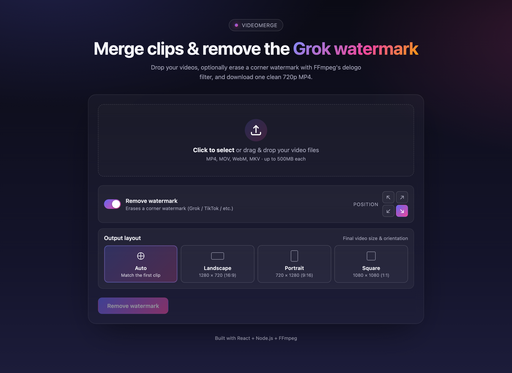
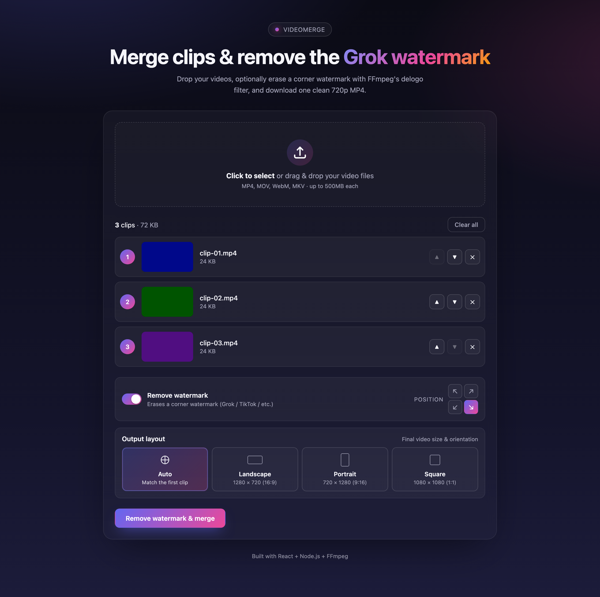
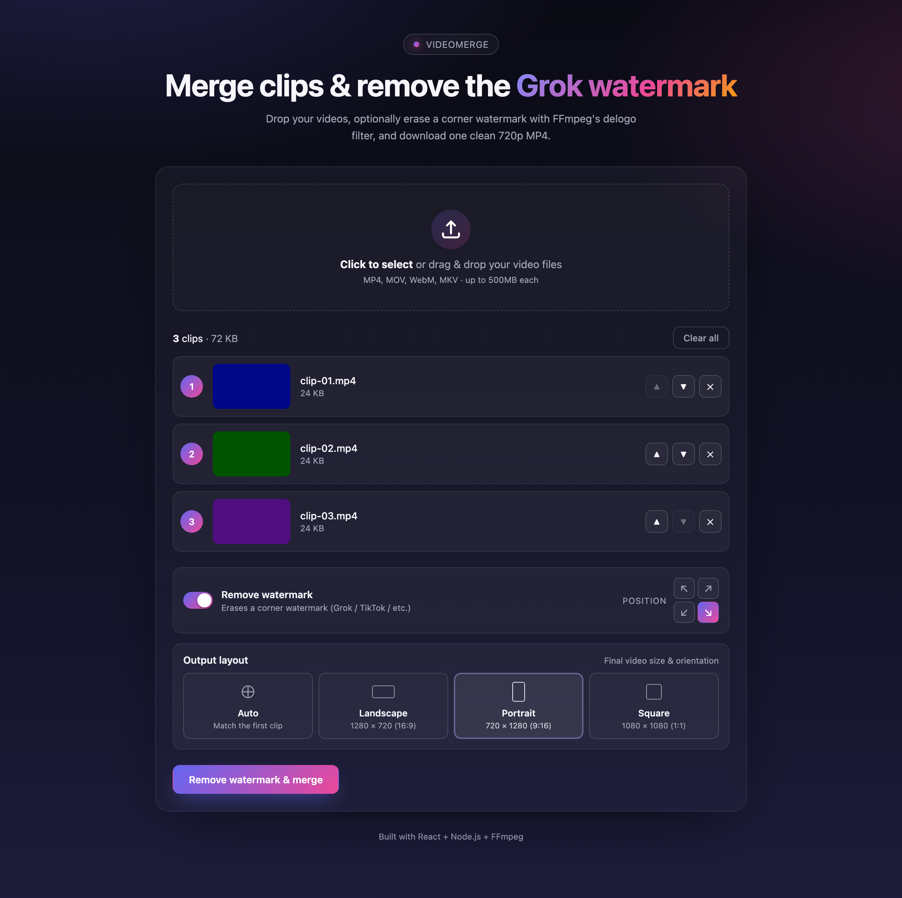
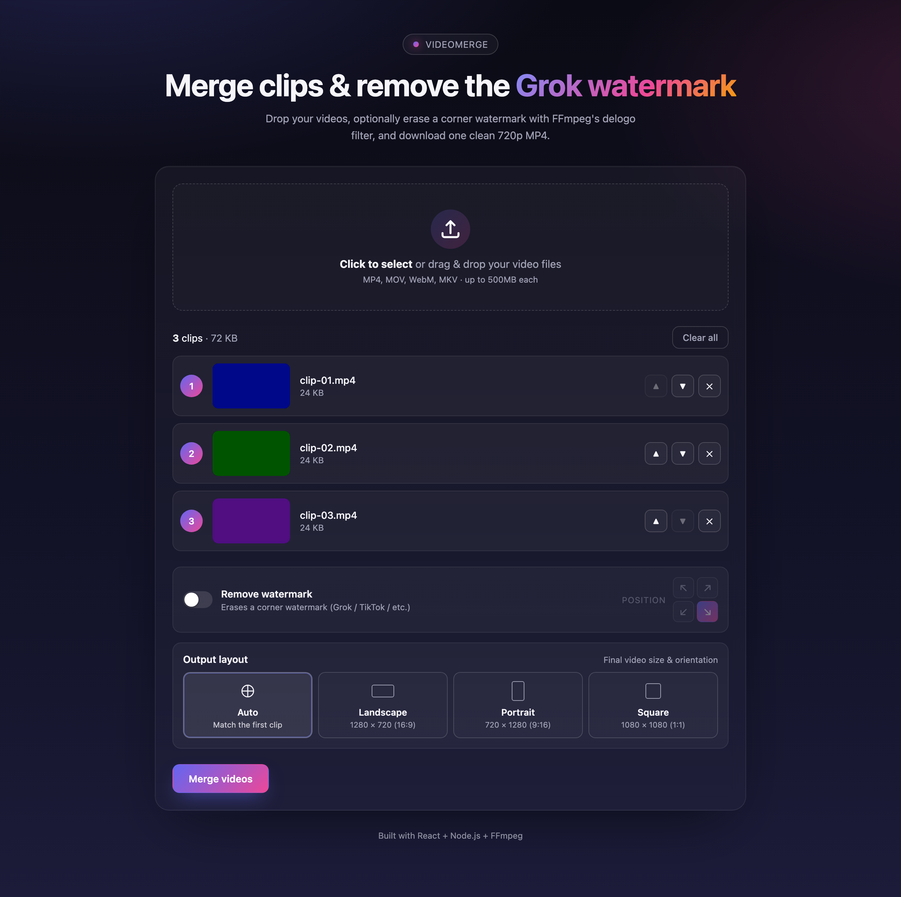

# Video Merger & Watermark Remover

Ek complete full-stack app jisse aap multiple short videos ko merge kar
sakte ho, optionally corner watermark (Grok / TikTok jaisa) hata sakte ho,
aur chuni hui layout (portrait / landscape / square) me ek clean MP4
download kar sakte ho.

- **Node backend:** Express + FFmpeg, port `5050` — merge, split, speed, watermark, music
- **Python backend:** FastAPI + yt-dlp + OpenAI, port `5051` — URL download qualities + Meme transcript
- **Frontend:** React + Vite, port `5173`
- Frontend sirf Node (`/api`) se baat karta hai. Node import/transcribe ko Python par proxy karta hai.



## Features

- **Multi-clip merge** — 2+ videos ko ek MP4 me concatenate karta hai
- **Drag-and-drop reorder** — clips ka order arrows ya drag se set karein
- **Watermark removal** — FFmpeg ke `delogo` filter se corner watermark
  ko surrounding pixels se inpaint karta hai
- **Position picker** — ↖ ↗ ↙ ↘ four corners me se koi bhi
- **Layout selector** — Auto / Landscape (1280×720) / Portrait (720×1280) / Square (1080×1080)
- **Single-video mode** — sirf 1 video bhi process kar sakte ho (watermark removal ke saath)
- **Live progress** — async job + status polling, frontend me progress bar
- **No extra FFmpeg install** — binary `ffmpeg-static` ke through bundled
- **URL import** — paste link, 360p / 720p / 1080p / Recommended MP4 choose karke download
- **Meme transcript** — video upload → exact, copy-able transcript (OpenAI)

## Screenshots

### Landing (empty state)

Drop videos, configure watermark removal, choose output layout.


### After loading clips

Drag-and-drop video thumbnails with reorder controls. "Remove watermark &
merge" button context-aware label change karta hai.



### Portrait layout selected

Portrait videos ko letterbox kiye bina full-screen 720×1280 me output deta hai.



### Watermark off (merge-only mode)

Toggle off karne par position picker dim ho jata hai, CTA "Merge videos" ban
jata hai.



## Project structure

```
.
├── backend/                 Node Express API (port 5050)
│   ├── server.js            Merge / split / music / proxy to Python
│   ├── .env                 OPENAI_API_KEY yahan rakho
│   └── package.json
├── backend-python/          FastAPI (port 5051)
│   ├── app.py               URL import + transcript
│   ├── start.sh             venv + install + run
│   ├── requirements.txt
│   └── README.md            Python commands
├── frontend/                React + Vite (port 5173)
├── scripts/
└── docs/screenshots/
```

## Requirements

- Node.js 18+ (LTS recommended)
- npm 9+
- Python 3.10+ (3.12 / 3.13 best). macOS system Python 3.9 yt-dlp ke liye kaafi nahi hai.

FFmpeg `ffmpeg-static` se bundled hai — alag install zaroori nahi.

## Setup

```bash
cd backend && npm install
cd ../frontend && npm install
```

Python (pehli baar):

```bash
cd backend-python
chmod +x start.sh
./start.sh
```

`backend/.env` me:

```bash
OPENAI_API_KEY=sk-...
```

## Run (development)

**Teen terminals** chahiye. Node ke baad Python band ho to Merge/Split/Music chalenge, Meme URL + transcript nahi.

**Terminal 1 — Node backend** (`http://localhost:5050`):

```bash
cd backend
npm start
```

Code watch chahiye ho to `npm run dev` (nodemon). Node auto-reload nahi karta `npm start` par — `server.js` change ke baad dubara start karo.

**Terminal 2 — Python backend** (`http://127.0.0.1:5051`):

```bash
cd backend-python
./start.sh
```

Manual:

```bash
cd backend-python
source .venv/bin/activate
uvicorn app:app --host 127.0.0.1 --port 5051 --timeout-keep-alive 300
```

Poori Python guide: [backend-python/README.md](backend-python/README.md)

**Terminal 3 — Frontend** (`http://localhost:5173`):

```bash
cd frontend
npm run dev
```

Frontend `/api/*` ko Node `5050` par proxy karta hai. Node import/transcribe ko Python `5051` par bhejta hai.

Browser: `http://localhost:5173`

Health:

```bash
curl http://localhost:5050/api/health
curl http://127.0.0.1:5051/api/health
```

## How to use

1. **Add clips** — Dropzone par click karein ya videos drag-drop karein
   (MP4 / MOV / WebM / MKV).
2. **Reorder** — Up/Down arrows se ya drag-and-drop se clips ka order set
   karein. Yahi order final video me hoga.
3. **Watermark removal (optional)** — toggle ON karke position select
   karein (default ↘ bottom-right Grok ke liye).
4. **Output layout** — choose karein:
   - **Auto** *(default)* — first clip ke orientation se match karta hai
   - **Landscape** 1280×720 (16:9) — YouTube / monitors
   - **Portrait** 720×1280 (9:16) — Reels / Shorts / TikTok
   - **Square** 1080×1080 (1:1) — Instagram feed
5. **Process** — CTA dabao (label automatically badalta hai based on
   selections). Live progress bar dikhega — uploading → normalising / cleaning
   → merging → complete.
6. **Download** — "Download merged video" button se MP4 save karein.

## API endpoints (backend)

| Method | Endpoint                | Description                                   |
| ------ | ----------------------- | --------------------------------------------- |
| GET    | `/api/health`           | Health check                                  |
| POST   | `/api/merge`            | Merge / speed / watermark cover               |
| POST   | `/api/split`            | Equal parts ZIP                               |
| POST   | `/api/slideshow`        | Images + music video                          |
| POST   | `/api/import/info`      | URL qualities (Python)                        |
| POST   | `/api/import/download`  | Download selected quality (Python)            |
| POST   | `/api/transcribe`       | Exact transcript (Python)                     |
| GET    | `/api/status/:jobId`    | Job progress (Node, else Python)              |
| GET    | `/api/download/:jobId`  | Output file                                   |

### `POST /api/merge` form fields

| Field             | Required | Default          | Values                                                          |
| ----------------- | -------- | ---------------- | --------------------------------------------------------------- |
| `videos`          | yes      | —                | One or more video files (2+ required when watermark off)        |
| `removeWatermark` | no       | `false`          | `true` / `false`                                                |
| `position`        | no       | `bottom-right`   | `bottom-right` / `bottom-left` / `top-right` / `top-left`       |
| `layout`          | no       | `auto`           | `auto` / `landscape` / `portrait` / `square`                    |

### Sample `curl`

```bash
# Merge two clips, remove bottom-right watermark, force portrait output
curl -F "videos=@clip1.mp4" \
     -F "videos=@clip2.mp4" \
     -F "removeWatermark=true" \
     -F "position=bottom-right" \
     -F "layout=portrait" \
     http://localhost:5050/api/merge
```

## Production build

```bash
cd frontend
npm run build       # generates frontend/dist
```

Aap `dist/` ko kisi bhi static host (Nginx, Vercel, Netlify, etc.) par
deploy kar sakte hain, aur backend ko alag deploy karke build time par
appropriate API base configure kar sakte hain (yaha simple Vite proxy use
ho rahi hai dev ke liye).

## Configuration

- **Per-file size limit:** 500 MB (`backend/server.js` → `multer` config)
- **Output quality:** H.264 CRF 20, AAC 192 kbps stereo, 30 fps
- **Watermark box size:** ~18% × 11% of source frame (oversized to cover
  Grok-style logo + soft glow). Tweak in `calcWatermarkBox()`.
- **Max files per merge:** 20 (multer config)
- **Layouts available:** Auto, 1280×720, 720×1280, 1080×1080

## Regenerating screenshots

Frontend dev server chal raha ho (`http://localhost:5173`), to:

```bash
cd scripts
npm install                       # first time only
npx playwright install chromium   # first time only
node make-sample-clips.js         # creates fixture videos
node take-screenshots.js          # writes docs/screenshots/*.png
```

## Notes / Tips

- Backend `uploads/` aur `output/` folders me temp files banata hai.
  Server restart pe purani files reh sakti hain — production me ek
  periodic cron job lagana acha rahega.
- Long jobs ke progress in-memory tracked hai. Multi-instance deploy karna
  ho to Redis/queue use karein.
- **delogo limitation:** Detailed backgrounds (busy scenes) par watermark
  ki jagah halki si blur dikh sakti hai. Solid backgrounds par result
  near-perfect hota hai.
# reels-maker
